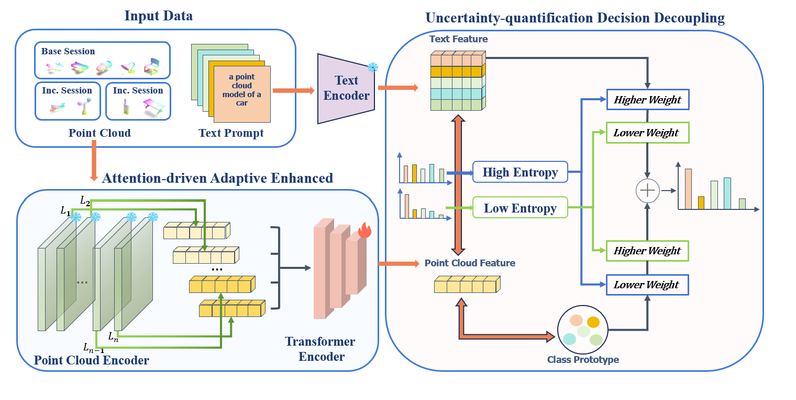

# Point-UQ

Point-UQ is a training and evaluation pipeline for 3D point-cloud few-shot class-incremental learning. This directory provides the Point-UQ workflow and experiment settings used by this project.

## Method Overview



## Installation

1. Clone the repository and enter `Point-UQ/`.
2. Create or activate a Python environment compatible with PyTorch, Uni3D, OpenCLIP, and the custom PointNet++ CUDA operators required by the Uni3D stack.
3. Install the dependencies required by the original FILP-3D and Uni3D codebase, and ensure the CUDA extensions are compiled successfully before running experiments.

The shell scripts provided in this directory assume a Linux environment, or a compatible environment such as WSL, with support for `bash` and symbolic links.

## Required Data and Pretrained Assets

Place the required data and model assets at the following repository-relative paths:

- `data/shapenet`
- `data/co3d`
- `data/modelnet`
- `data/scanobjnn`
- `uni3D/trainedModel/clip_model/open_clip_pytorch_model.bin`
- `uni3D/trainedModel/checkpoints/model_b.pt`

The `uni3D/` directory must also contain the minimal Uni3D runtime files used by this project, including:

- `uni3D/data/templates.json`
- `uni3D/data/datasets.py`
- `uni3D/data/dataset_catalog.json`
- `uni3D/data/labels.json`
- `uni3D/data/utils/`
- `uni3D/models/`
- `uni3D/utils/`

## Repository Layout

- `main.py`: main training and evaluation entry point
- `sessions.py`: dataset-pair definitions and session split configuration
- `models/point_uq_model.py`: Point-UQ model implementation
- `datasets/`: dataset loaders and session utilities
- `run.sh`: shell launcher
- `prepare_assets.sh`: optional asset-link helper
- `data/`: dataset directories
- `uni3D/`: Uni3D runtime subtree
- `base_train/`: saved base-session checkpoints
- `exp_results/`: experiment outputs

## Preparing Assets

The default workflow expects all required assets to be placed directly at the repository-relative paths listed above.

If the assets are stored elsewhere, you may create symbolic links into the expected runtime layout with:

```bash
bash prepare_assets.sh
```

By default, `prepare_assets.sh` reads from `Point-UQ/assets/`. You may override the source locations through environment variables such as:

```bash
ASSETS_ROOT=../assets bash prepare_assets.sh
```

You may also override individual dataset and checkpoint paths with:

- `SHAPENET_ROOT`
- `CO3D_ROOT`
- `MODELNET_ROOT`
- `SCANOBJNN_ROOT`
- `CLIP_PRETRAINED_SRC`
- `UNI3D_CKPT_SRC`

Dataset roots may also be overridden at runtime through the `POINT_UQ_*_ROOT` environment variables or the corresponding command-line arguments handled by `sessions.py`.

## Running Experiments

Supported experiment settings:

- `shapenet -> co3d`
- `shapenet -> scanobjnn`
- `modelnet -> scanobjnn`
- `shapenet -> null`
- `modelnet -> null`
- `co3d -> null`

Here, `null` indicates that no second dataset is appended on that side of the session schedule.

In cross-dataset settings, the first dataset is the base dataset used to form the initial session, and the second dataset is the incremental dataset used to supply the later incremental sessions. For example, in `shapenet -> co3d`, ShapeNet provides the base session and CO3D provides the incremental sessions.

Example commands:

```bash
bash run.sh shapenet co3d
bash run.sh shapenet scanobjnn
bash run.sh modelnet scanobjnn
bash run.sh shapenet null
bash run.sh modelnet null
bash run.sh co3d null
```

You may also launch the main entry directly:

```bash
python main.py --base_dataset shapenet --incremental_dataset co3d
```

To use a specific GPU, prefer `CUDA_VISIBLE_DEVICES`:

```bash
CUDA_VISIBLE_DEVICES=0 bash run.sh shapenet co3d
```

## Outputs

Experiment outputs are written to:

- `base_train/`
- `exp_results/`

The `exp_results/` directory stores logs generated by the current run.

## Citation

If you use Point-UQ in your research, please cite the accompanying paper:

*Point-UQ: An Uncertainty Quantification Paradigm for Point Cloud Few-Shot Class-Incremental Learning*.
